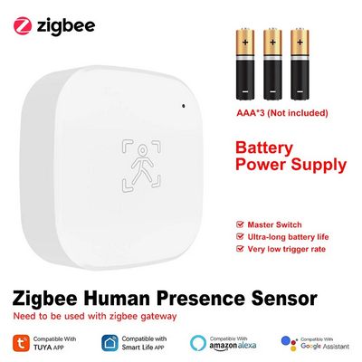
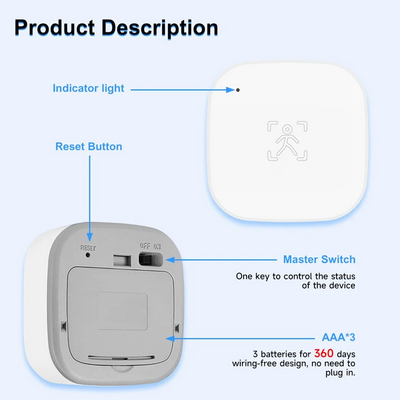

                


# Zigbee Converter for Tuya / iHseno Human Presence Sensor

Converted the Zigbee2MQTT from Alexamig ([repo](https://github.com/Alexamig/ihseno-human-presence-sensor))

Integrating the Tuya / iHseno Human Presence Sensor (model `_TZE284_debczeci`) with ZHA.

## Supported Devices
- Tuya / iHseno Human Presence Sensor ([AliExpress Link](https://www.aliexpress.com/item/1005009447202086.html))

## Features
- Human presence detection
- Battery level monitoring
- Adjustable PIR sensitivity (low/medium/high)
- Configurable PIR delay time (15s/30s/60s)

## Installation
1. Create a custom quirk dir in HA, e.g., /config/custom_zha_quirks
2. In configuration.yaml, point to this directory:
```
zha:
  enable_quirks: true
  custom_quirks_path: /config/custom_zha_quirks/
```
3. Copy the `ts0601_motion.py` file in the directory above.
4. Restart Home Assistant


## Supported Features
| Feature | Description |
|---------|-------------|
| `presence` | Presence detection (true/false) |
| `battery` | Battery level in percentage |
| `pir_sensitivity` | PIR sensitivity (low/medium/high) |
| `pir_time` | PIR delay time (15s/30s/60s)    Attention: delay time due to improper software does not correspond to the real choice |

